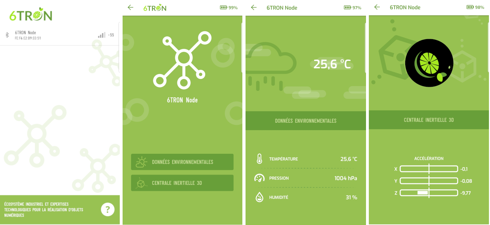
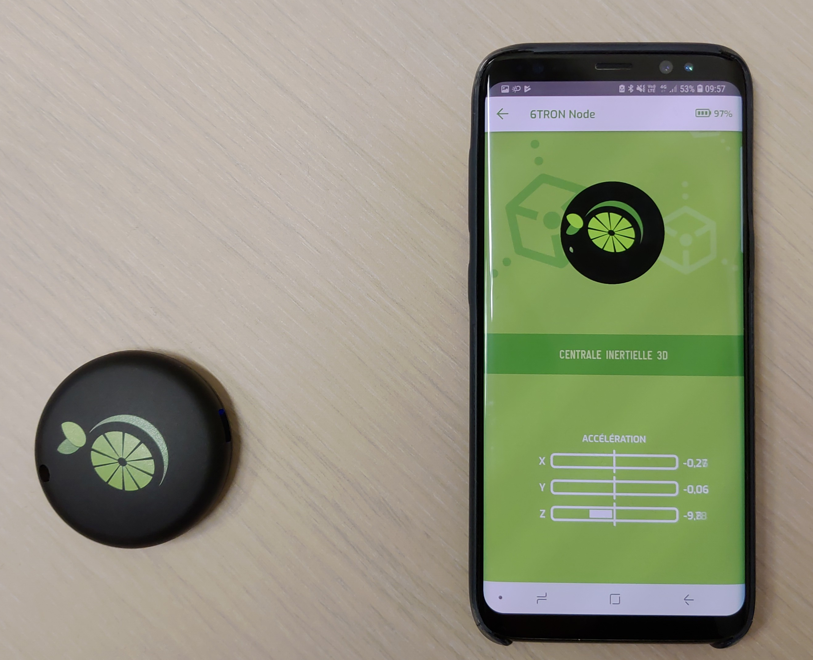

# Z_Motion demo

## Preview

This demo demonstrates the connection to 6TRON mobile application using Z Motion object, and the vizualisation of data pushed by the object through BLE.

## Requierements

### Hardware:

You can deploy this application using 6TRON prototyping boards:

* [Zest_Core_STM32L496RG](|catie_6tron/zest-core-stm32l496rg-hardware|master)
* [Zest_IMU](|catie_6tron/zest-imu-hardware|master)
* [Zest_Battery_LiPo](|catie_6tron/zest-battery-lipo-hardware|master)
* [Zest_Radio_SPBTLE_RF0](|catie_6tron/zest-radio-spbtle-rf0-hardware|master)

**or** into the integrated object Z_Motion:

* [The Z_Motion](|catie_6tron/z-motion-hardware|master)

<!-- [restricted=members] -->

### Software:

* [Z_Motion demo software](https://gitlab.com/catie_6tron/6tron-ble-node)

<!-- [/restricted] -->

### Application 

you can download the 6TRON application designed for this device:

* [6TRON application for Android](https://play.google.com/store/apps/details?id=com.minkagency.a6tron)

* [6TRON application for iOS](https://itunes.apple.com/us/app/6tron/id1363884392?mt=8)

## Overview

The Z_Motion object pushes his orientation and environmental data (temperature, humidity and pressure) to the 6tron mobile application through BLE 

